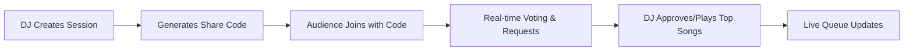

**Spotify Party Mode**

**Real-time collaborative music voting platform** - **UIUC Research Park 2025 Summer Hackathon Winner - 1st Place** 

<div align="center">

**[🎥 Watch Demo Video](https://www.youtube.com/watch?v=FOzD3VdYtFc)**

*Democratizing music, one vote at a time*

</div>

---

## 🚀 Overview

Spotify Party Mode revolutionizes the DJ-audience experience by creating a seamless bridge between performers and crowds. Audiences can vote on songs, request tracks, and influence playlists in real-time, while DJs maintain ultimate creative control.

**Perfect for:** Bars • Restaurants • House Parties • Events • DJ Sets • Clubs

---

## ✨ Key Features

### 🎯 For DJs
- **Session Management:** Create and control music sessions with unique codes
- **Smart Request System:** Instant popup notifications for song approval/denial
- **Queue Control:** Real-time queue management with vote-based ordering
- **Spotify Integration:** Access to 100M+ songs with web playback

### 🎉 For Audiences  
- **Live Voting:** Upvote/downvote songs to influence the queue
- **Song Requests:** Search and request any Spotify track
- **Zero Friction:** Browser-based participation, no app downloads
- **Real-time Updates:** See queue changes and voting results instantly

### ⚡ Technical Highlights
- **Real-time Synchronization:** WebSocket-powered live updates
- **Responsive Design:** Works on all devices and screen sizes
- **Secure Authentication:** Spotify OAuth 2.0 integration
- **Scalable Architecture:** Supports multiple concurrent sessions

---

## 🛠️ Tech Stack

| Component | Technology |
|-----------|------------|
| **Frontend** | Vanilla JavaScript, TailwindCSS, Spotify Web Playback SDK |
| **Backend** | Node.js, Express.js, Socket.IO |
| **Real-time** | WebSockets for live voting and updates |
| **Authentication** | Spotify OAuth 2.0 |
| **Styling** | TailwindCSS with custom Spotify-themed components |

---

## 🚀 Quick Start

### Prerequisites
- Node.js 16+
- Spotify Premium account (for playback features)
- Spotify Developer App ([Create here](https://developer.spotify.com/dashboard))

### Installation

```bash
# Clone the repository
git clone https://github.com/Sakshyam-Patro/Spotify-Party-Mode.git
cd Spotify-Party-Mode

# Install dependencies
npm install

# Start the application
npm start

# Open http://127.0.0.1:3001 in your browser
```

### Environment Setup

#### 🔧 Spotify App Configuration

**Important:** Spotify has new redirect URI requirements (April 2025). Follow these steps:

1. **In your [Spotify Developer Dashboard](https://developer.spotify.com/dashboard):**
   - Use `http://127.0.0.1:3001/auth/spotify/callback` (not localhost)
   - For production/demos, use HTTPS URLs only

2. **Create `.env` file:**

```env
SPOTIFY_CLIENT_ID=your_spotify_client_id
SPOTIFY_CLIENT_SECRET=your_spotify_client_secret
SPOTIFY_REDIRECT_URI=http://127.0.0.1:3001/auth/spotify/callback
PORT=3001
```

#### 🌐 Multi-Device Testing & Demos

For sharing with others or testing across devices:

```bash
# Install ngrok for secure public access
npm install -g ngrok

# In a separate terminal, create secure tunnel
ngrok http 3001

# Copy the HTTPS URL (e.g., https://abc123.ngrok.app)
# Update both:
# 1. Your .env file:
SPOTIFY_REDIRECT_URI=https://your-ngrok-url.ngrok.app/auth/spotify/callback

# 2. Your Spotify app settings in the developer dashboard
```

**✅ Spotify Requirements:**
- ✅ Use `127.0.0.1` instead of `localhost` for local development
- ✅ Use HTTPS for production/sharing (ngrok provides this)
- ✅ Exact URI match between .env and Spotify dashboard

---

## 🎮 How It Works



1. **🎧 DJ Setup:** Connect Spotify account and create session
2. **📱 Audience Join:** Enter session code in any browser
3. **🗳️ Democratic Voting:** Real-time voting determines song priority
4. **🎵 Smart Requests:** Popup notifications for DJ approval
5. **🎶 Live Playback:** DJ plays crowd-approved songs

---

## 🏆 Why This Won the Hackathon

### 💡 **Problem Solved**
- Eliminates the communication gap between DJs and audiences
- Reduces interruptions and "song request" chaos
- Creates engaging, interactive music experiences

### 🎯 **Market Impact**
- **Immediate Deployment:** Ready for real-world venue implementation
- **Universal Appeal:** Works for any music event or gathering
- **Scalable Solution:** Can handle multiple concurrent sessions

### 💻 **Technical Excellence**
- **Real-time Architecture:** Sub-second synchronization across devices
- **User Experience:** Intuitive design requiring zero learning curve
- **Robust Integration:** Seamless Spotify API implementation

---

## 📂 Project Structure

```
spotify-party-mode/
├── server.js              # Express server & Socket.IO handlers
├── package.json           # Project dependencies
├── .env                   # Environment variables (Spotify credentials)
└── public/
    ├── index.html         # Main application UI
    └── app.js            # Client-side JavaScript logic
```

---

## 🎯 Live Demo Features

### DJ Dashboard
- Session creation and management
- Real-time request notifications with album art
- One-click song approval/denial
- Live queue management with vote counts

### Audience Interface  
- Song search with 100M+ Spotify tracks
- Live voting system with instant feedback
- Request submission with status updates
- Real-time queue visualization

---

## 🎥 Demo Video

**[🎬 Watch the Full Demo](YOUR_YOUTUBE_LINK_HERE)**

See Spotify Party Mode in action - from session creation to live voting and playback!

---

## 🛡️ Requirements

- **For DJs:** Spotify Premium account (required for playback)
- **For Audiences:** Any device with internet browser
- **Technical:** Modern web browser with JavaScript enabled

---

## 🚀 Future Enhancements

- [ ] Mobile app versions (iOS/Android)
- [ ] Advanced analytics dashboard
- [ ] Playlist export functionality
- [ ] Integration with other music platforms
- [ ] Enhanced DJ tools and effects

---

## 📞 Contact & Attribution

**🧑‍💻 Developer:** Sakshyam Patro  
**🏆 Achievement:** UIUC Research Park 2025 Summer Hackathon Winner  
**📧 Contact:** [Your Email]  
**🔗 LinkedIn:** [Your LinkedIn]  
**💻 GitHub:** [@Sakshyam-Patro](https://github.com/Sakshyam-Patro)

---

<div align="center">

**🎵 Built with ❤️ for music lovers everywhere 🎵**

⭐ *If you found this project interesting, please star the repository!* ⭐

</div>

---

## 📄 License

This project is licensed under the MIT License - see the [LICENSE](LICENSE) file for details.

---

*Built during the UIUC Research Park 2025 Summer Hackathon*
